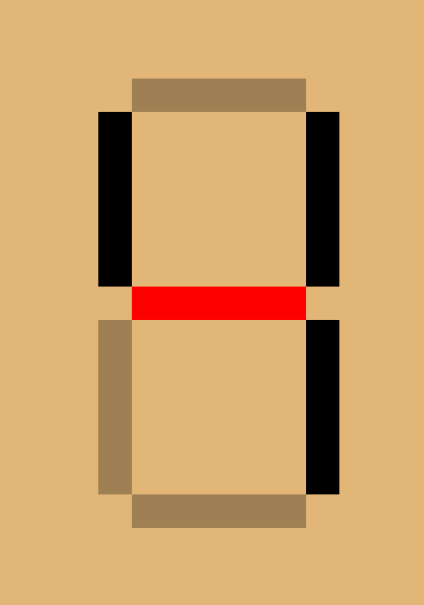
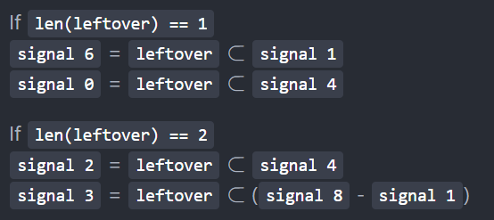

# Day 8

Puzzle 1 is simple since you just need to count how many `1, 4, 7, and 8` appear. This can be done by simple check if `len(signal)` in inside `known_digit_segments` where `known_digit_segments` is a list of segment number of particular digit. For example, digit 1 has 2 segments and digit 7 has 3 segments.

Puzzle 2 is actually complicated at first. The idea is to use `set()`. First we create 2 containers that will hold `digit -> signal` and `unknown signal`. 1 is a dictionary and another is a list.
That we update those 2 containers with signals that we know which is signals for digit 1, 4, 7 and 8 into the dictionary.

Now, the tricky part is to understand on how to identify each unknown signal. After further analysis, we found that all of these signals is divided into 3 group.

1. Unique Signal [1, 4, 7, 8]
2. 5-Segments Signal [2, 3, 5]
3. 6-Segments Signal [0, 6, 9]

We can take advantage on our set by looking for leftover connection between `signals of 8` and `the unknown signal`. Below we can see the process on how to identify the unknown signal.

To I dentify signal 3.

Step 1:


Step 2:


Then we compare result from step 1 and step 2. If result from step 1 is a subset of the result from step 2, then it is a signal for 3.


To identify signal 0

Step 1:


Step 2:


We know it is the signal for 0 if result from step 1 is a subset of signal for 4.

```python

for unknown_signal in unknown_signals:
        leftover_wire = decoded_signals[8].difference(unknown_signal)
        if len(leftover_wire) == 1:
            if leftover_wire.issubset(decoded_signals[1]):
                decoded_signals[6] = unknown_signal
            elif leftover_wire.issubset(decoded_signals[4]):
                decoded_signals[0] = unknown_signal
            else:
                decoded_signals[9] = unknown_signal
        elif len(leftover_wire) == 2:
            if leftover_wire.issubset(decoded_signals[4]):
                decoded_signals[2] = unknown_signal
            elif leftover_wire.issubset(
                decoded_signals[8].difference(decoded_signals[1])
            ):
                decoded_signals[3] = unknown_signal
            else:
                decoded_signals[5] = unknown_signal

```

The piece of code above do just that. We know that we can identify all of these unknown signal by looking if the leftover segment is a subset of certain signal. Therefore, we will loop through all of this unknown signal and check if that signal fulfill certain criteria. The criteria that we are looking is as below:



For signal 9, we know that it is from group `6-Segments Signal` and we already able to identify the other 2 from the same group. So if all the check fail, we can say that that unknonw 6-Segments Signal is actual a 9. The same to 5.

[<sup>< main page](../README.md#My-Attempt-in-AoC-2021)
