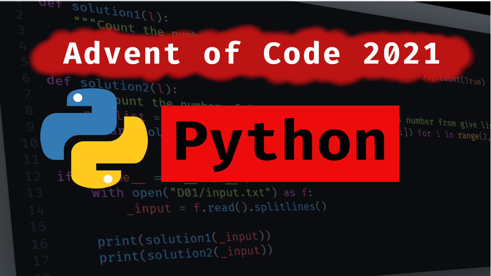

# My Attempt in AoC 2021.

Each daily challenges including nessecary input will be keep inside a folder.
`D01` is for challenge from day 1.

---

## Table of Content:

- [Day 1](./D01/README.md#day-1)
- [Day 2](./D02/README.md#day-2)
- [Day 3](./D03/README.md#day-3)
- [Day 4](./D04/README.md#day-4)
- [Day 5](./D05/README.md#day-5)
- [Day 6](./D06/README.md#day-6)
- [Day 7](./D07/README.md#day-7)
- [Day 8](./D08/README.md#day-8)
- [Day 9](./D09/README.md#day-9)
- [Day 10](./D10/README.md#day-10)

---

<b>Check out links below!:</b>

[![yt-icon][1.1]][1.2]
[![twitter-icon][2.1]][2.2]
[![facebook-icon][3.1]][3.2]

[1.1]: ./Assets/social-media-icons/youtube_red.png
[1.2]: https://www.youtube.com/watch?v=Invlu2HLcBA&list=PLMzyOn0orr7zDnq32QlDgo0nAGbU-2K2A
[2.1]: ./Assets/social-media-icons/twitter.png
[2.2]: https://twitter.com/AkaruiYamiCode
[3.1]: ./Assets/social-media-icons/facebook.png
[3.2]: https://www.facebook.com/AkaruiYamiCode
