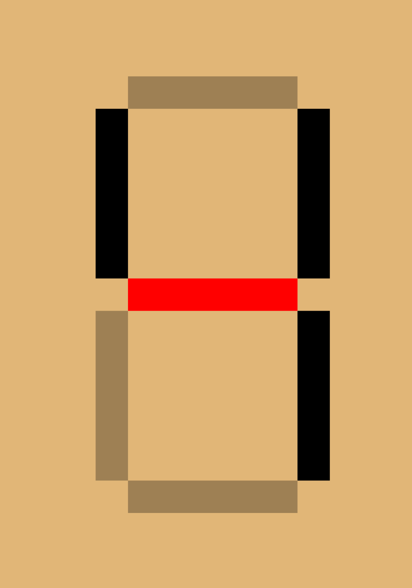

# My Attempt in AoC 2021.

Each daily challenges including nessecary input will be keep inside a folder.
`D01` is for challenge from day 1.

You can checkout my YouTube Video for AoC Series:\
[AoC 2021 YouTube Playlist](https://www.youtube.com/watch?v=Invlu2HLcBA&list=PLMzyOn0orr7zDnq32QlDgo0nAGbU-2K2A)

## Day 1

The puzzle is quite simple. You only need to count how many times the given input increases compare to previous input. So basically, You just create a new list that contains booleans. It is true if the current input is greater than previous input.

Second puzzle is also quite simple. You just need to prepare the given list of input. Basically, you just need to create new list of input and pass it to function from solution 1 since the concept is the same but the only different is the input uses to compare between current and previous input.

## Day 2

For this set of puzzle, You create a special function to obtain a set of instructions from given list of input by splitting it to two part, `command` and `value`. Then you just need to check the `command`. If it forward, then add the respactive variable to the given `value`.

The second part of the puzzle is really similar to the first one, but there is a new variable that needed to be add into the function.

## Day 3

For this puzzle, you need to find `gamma_rate` first. From there, you can just flip `gamma_rate` using `XOR` so that you get `epsilon_rate`.
To find `gamma_rate`, first you need to loop through each bit of the binary numbers to find the most common bit.

```python
gamma_bit = sum((_l >> i) & 1 for _l in l) > len(l) // 2
```

As you can see, the code above is to find the most common bit, by adding up all `1's` and compare it to the lenght of binary report. If the sum is greater than the length of binary report, therfore we know that 1 is the most common, so that line of code should return `True` which is `1`.

```python
gamma_rate |= gamma_bit << i
```

The code above will add the result into `gamma_rate`.

For puzzle 2, it is a bit of hasle. First you need to make a copy of binary report since you are going to discard the item that does not fit the requirment.
To find the most common, we can reuse the same line of code that we use for finding gamma_rate but with minor adjustment.

```python
o2_bit = sum((\_l >> (n_bit - i)) & 1 for \_l in o2_l) >= len(o2_l) / 2
```

First, instead of checking the bit from right, we check the bit from the left. That is why we have `(n_bits - i)`.
Then we just need to update our list.

```python
    o2_l = [_l for _l in o2_l if (_l >> (n_bit - i)) & 1 == o2_bit] or o2_l
```

For `co2` we can do the same but instead greater than length of report, we find if it is lesser then the length of report.

```python
    co2_bit = sum((_l >> (n_bit - i)) & 1 for _l in co2_l) < len(co2_l) / 2
```

## Day 4

After analysing the input, you will see that the first line from the input is a set of numbers separated by comma. Therefore, you can get the first important variable which is `draws` as a list of str numbers. Then to get board, you need to read first 5 lines after finding an empty string since each board is separated by a new line.

After getting all important variables, `draws` and `boards`, you can start build your `Board` class so that you can manipulate the boards much easier. There, you can create several methods, `check_for_win`, `mark`, and `get_score`. Don't forget to create a copy of the board data so that you can reset the board after marking the data. To mark a data, I simply change the data to `"X"` since the marked data are not really important. We only need to know that it was already marked.

From there, we can calculate the score collecting all remaining unmarked data and multpy it with the last drawn number.

```python
        return sum(int(data) for data in _flatten_data if data != "X") * int(last_draw)
```

As you can see, marked data can be ignore by using if statement.

To find the first winner, you just need to return the score after finding the first winner. To find last winner, simply discrad the winning board from a copy of board list until none remain inside that list. The last item that was discarded is the last winner.

## Day 5

So, this puzzle is a bit simple. First you prepare the data. In this case, I decide to create a list of lines where each line is a list of points. For puzzle 1, you only need to consider the line where `x1 == x2` or `y1 == y2`. Then these lines will then registered to a dictionary that hold all point inside `world` or `plane`.

```python
get_step = lambda l: 0 if l[0] == l[1] else (l[1] - l[0]) / abs(l[1] - l[0])
```

Lambda function above are use to calculate the direction of axis. If the line is a horizontal line, then the direction for `x-axis` is `0`. If the line is a vertical line, then the direction for `y-axis` will be `0`. If the `end point` is behind `start point`, then the direction for the respective axis will be `-1`. After getting the direction of the line, we can then calculte the distance of the line by adding the absolute value of the difference between two points.

```python
    distance = abs(end[0] - start[0]) + abs(end[1] - start[1])
```

Then, we will update our `world dictionary`. The dicrionary will hold the `coordinate of point` on imaginary plain and the value is `the number of times a line went through the point`.

```python
for i in range(distance + 1):
        x = start[0] + i * x_step
        y = start[1] + i * y_step
        world[(x, y)] += 1
```

After that, we just need to count, how many point inside the world dictionary that the value is greater than 1.

For puzzle 2, there is a minor adjustment that we need to make. Instead of adding two absolute value of the difference between two points, we find the max value between `x2-x1` and `y2-y1`

```python
    distance = max(abs(end[0] - start[0]), abs(end[1] - start[1]))
```

This is because, for diagonal line, the result from `x2-x1` and `y2-y1` will both return exact same result which is double our distance. The previous code can be use for puzzle 1 because one of two axis will return 0. We took the max value because for horizontal line, `x2-x1` will return 0 but `y2-y1` while return some value which will surely be greater than 0. It is the same for vertical line but vise versa.

## Day 6

As for day 6, you need firt to prepare a dictionary that hold `timer: n_fish` where the `timer` is the input that were given for the puzzle, and `n_fish` is the number of timer in side the input. This is to make it easier for us to loop through the fishes.

```python
def update_fish(fishes):
    new_fish_lib = defaultdict(int)
    for timer, n_fish in fishes.items():
        if timer == 0:
            timer = 7
            new_fish_lib[8] += n_fish
        new_fish_lib[timer - 1] += n_fish
    return new_fish_lib
```

The function above will then create a new dictionary with updated information about our fishes. For today puzzle, the solution is much more simple since both task require you to do the same thing. You just need to give the number of days as specify by the puzzle into the function below.

```python

def solution(fishes, days):
    fish_lib = fishes.copy()
    for _ in range(days):
        fish_lib = update_fish(fish_lib)

    return sum(fish_lib.values())

```

The function above create a copy of fishes library since we are going to update the library to avoid changes to the original. Then it will update that library for `n=days` times. Lastly it will return the sum of the values from the last updated fishes library.

## Day 7

After collecting the necessary information, you can loop from 0 until halve of the maximum position and stores the sum of step requires to reach to that point for each crab submarine. Then from the list you created, you can then return the minimum value.

As for the puzzle 2, instead of storing the step, what you need is to use arithmatic progression since the command difference for each step is contant 1. The formula is `S = n(a+L)/2` where n is steps, a is the initial value (which is 1), and L is the last value (which is the same as steps).

```python
    (abs(new_pos - current_pos) * (1 + abs(new_pos - current_pos))) // 2
```

## Day 8

Puzzle 1 is simple since you just need to count how many `1, 4, 7, and 8` appear. This can be done by simple check if `len(signal)` in inside `known_digit_segments` where `known_digit_segments` is a list of segment number of particular digit. For example, digit 1 has 2 segments and digit 7 has 3 segments.

Puzzle 2 is actually complicated at first. The idea is to use `set()`. First we create 2 containers that will hold `digit -> signal` and `unknown signal`. 1 is a dictionary and another is a list.
That we update those 2 containers with signals that we know which is signals for digit 1, 4, 7 and 8 into the dictionary.

Now, the tricky part is to understand on how to identify each unknown signal. After further analysis, we found that all of these signals is divided into 3 group.

1. Unique Signal [1, 4, 7, 8]
2. 5-Segments Signal [2, 3, 5]
3. 6-Segments Signal [0, 6, 9]

We can take advantage on our set but looking for leftover connection between `signals of 8` and `the unknown signal`. Below we can the process on how to identify the unknown signal.

To I dentify signal 3.

Step 1:


Step 2:


Then we compare result from step 1 and step 2. If result from step 1 is a subset of the result from step 2, then it is a signal for 3.


To identify signal 0

Step 1:


Step 2:


We know it is the signal for 0 if result from step 1 is a subset of signal for 4.

```python

for unknown_signal in unknown_signals:
        leftover_wire = decoded_signals[8].difference(unknown_signal)
        if len(leftover_wire) == 1:
            if leftover_wire.issubset(decoded_signals[1]):
                decoded_signals[6] = unknown_signal
            elif leftover_wire.issubset(decoded_signals[4]):
                decoded_signals[0] = unknown_signal
            else:
                decoded_signals[9] = unknown_signal
        elif len(leftover_wire) == 2:
            if leftover_wire.issubset(decoded_signals[4]):
                decoded_signals[2] = unknown_signal
            elif leftover_wire.issubset(
                decoded_signals[8].difference(decoded_signals[1])
            ):
                decoded_signals[3] = unknown_signal
            else:
                decoded_signals[5] = unknown_signal

```

The piece of code above do just that. It trying to identify the signal by using the method above.
